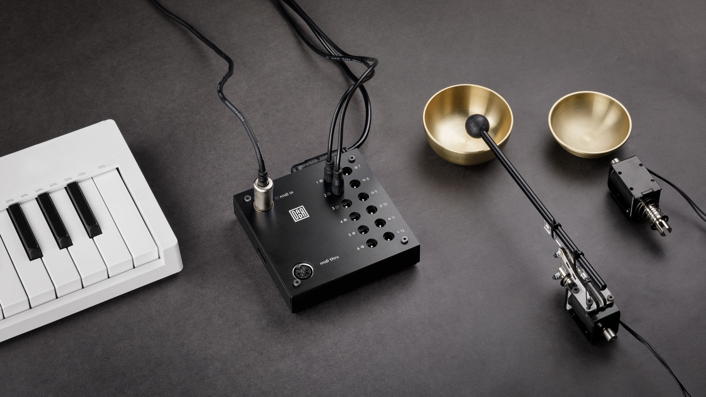

# automat toolkit

Electro‑acoustic drums for the real world.
{: .fs-6 .fw-300 }

**New here?** Connect the [Power Supply]({{ site.baseurl }}/automat-toolkit/power-supply/) and the [Solenoids]({{ site.baseurl }}/automat-toolkit/motors/), map the outputs with [Simple LEARN]({{ site.baseurl }}/automat-toolkit/automat-controller/simple-learn/) or [Advanced LEARN]({{ site.baseurl }}/automat-toolkit/automat-controller/advanced-learn/) and start making music. 

---

| Section | Description |
|:--------|:------------|
| [automat controller]({{ site.baseurl }}/automat-toolkit/automat-controller/) | The 12-output MIDI-to-solenoid controller — original and MK2 |
| [automat eurorack]({{ site.baseurl }}/automat-toolkit/automat-eurorack/) | 8 HP module for triggering solenoids directly from your modular rig |
| [Power Supply]({{ site.baseurl }}/automat-toolkit/power-supply/) | Connecting the supply, voltage and current ratings |
| [Motors]({{ site.baseurl }}/automat-toolkit/motors/) | Driving DC motors from the automat outputs |
| [Adapters]({{ site.baseurl }}/automat-toolkit/adapters/) | Lego, Makerbeam, Microphone-stand and Magic Arm mounting adapters |
| [Elements]({{ site.baseurl }}/automat-toolkit/elements/) | Solenoid beaters, mallets, material drums and the Little Wingman |
| [LED Splitters]({{ site.baseurl }}/automat-toolkit/led-splitters/) | Plug-and-play LED feedback for every beater |
{: .dada-toc-table }

---

## What you can do with it

- **Play real-world objects** — solenoid beaters hit cans, boxes, metal, wood, drums, found objects.
- **Sequence from any source** — any DAW, iOS app, hardware MIDI sequencer or the on-board standalone mode on the MK2 / eurorack.
- **Mix and match** — combine the controller with motors, LED splitters and the full range of mounts and adapters to build your own mechanical instruments.
- **Keep it open** — the hardware is documented, adapters come with downloadable SVG files, and the firmware is open.

---

see [github.com/dadamachines/docs](https://github.com/dadamachines/docs){:target="_blank"} to contribute.  
e-mail <a href="&#109;&#97;&#105;&#108;&#116;&#111;&#58;%68%65%6C%70%40%64%61%64%61%6D%61%63%68%69%6E%65%73%2E%63%6F%6D">help@dadamachines.com</a> or visit [forum.dadamachines.com](https://forum.dadamachines.com/){:target="_blank"} if you see needed corrections.
