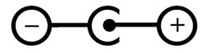

For the Automat Board / Controller you need a center positive DC Power Supply. \
Check if you find an Image like this on the Power Supply:

{: .important }
> The + has to be in the Center!

The Plug Dimension is 2.5 x 5.5 mm.\
The Operating Voltage Range is 9-24V DC.
