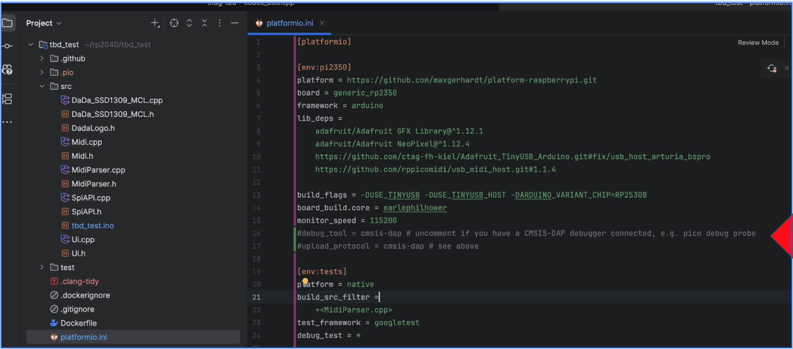
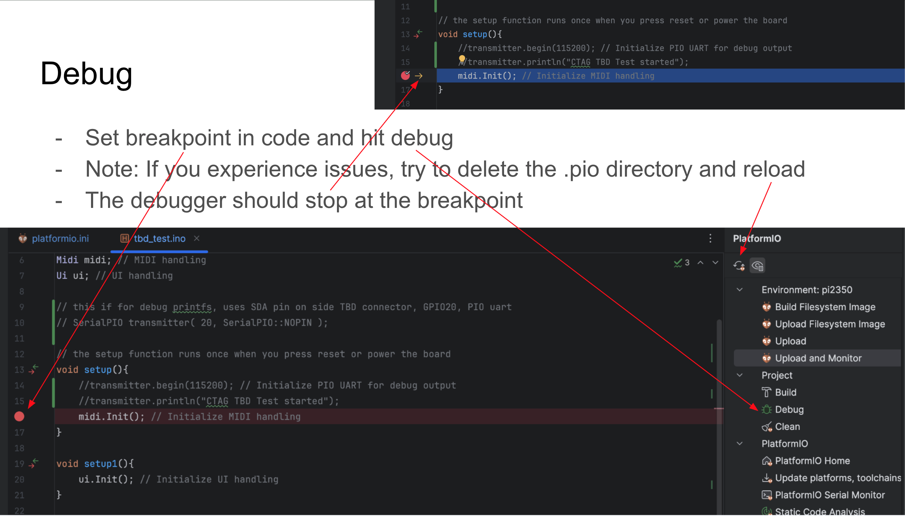
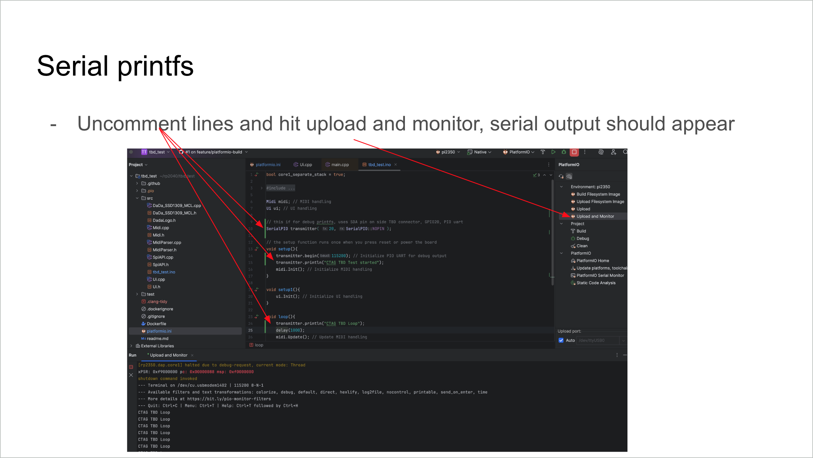

# debug

## ESP32-P4 
ESP32-P4 debugging with USB JTAG and VS Code.
[https://developer.espressif.com/blog/2025/05/debugging-with-vscode/](https://developer.espressif.com/blog/2025/05/debugging-with-vscode/)
[https://developer.espressif.com/blog/2025/06/debugging-with-vscode-part-2/](https://developer.espressif.com/blog/2025/06/debugging-with-vscode-part-2/)

ESP32-P4 debugging with USB JTAG and CLion.
[https://developer.espressif.com/blog/clion/](https://developer.espressif.com/blog/clion/)

## RP2350B

### Preface
Without this setup you can upload thru platformio "upload" via .uf2 image upload (standard rp2350 way)
With this setup you will be able to flash, debug and monitor the rp2350
The demo project uses cmsis-dap / SWD interface for flashing and debugging the chip
A PIO serial is used to allow for debug printfs, which does not consume any of the uart peripherals of the rp2350

### Requirements
- Get an rp pico to be set up as cmsis-dap interface
- Flash debugprobe fw [https://github.com/raspberrypi/debugprobe/releases](https://github.com/raspberrypi/debugprobe/releases)
- If using CLion get platformio for CLion [https://www.jetbrains.com/help/clion/platformio.html](https://www.jetbrains.com/help/clion/platformio.html)
- If using VSCode get platformio for it [https://docs.platformio.org/en/latest/integration/ide/vscode.html](https://docs.platformio.org/en/latest/integration/ide/vscode.html)
- Clone TBD demo project [https://github.com/ctag-fh-kiel/rp2350-arduino-tbd-fw.git](https://github.com/ctag-fh-kiel/rp2350-arduino-tbd-fw.git)

### Setup

Uncomment relevant lines in platformio.ini file

 

Source: [Google Slides Debug Document](https://docs.google.com/presentation/d/1Ueqo-6NZIdfJaPn4f1pV_JdaAnG25v9Co6zBZ0iWqKk/edit?usp=sharing){:target="_blank"}