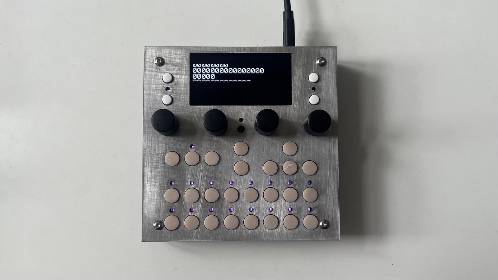

Oh wow,\
it looks like you’re one of the early adopters of the new dadamachines – TBD DSP toolkits!

The **dadamachines – TBD DSP toolkit** is the latest iteration in a family of musical tools and instruments based on the ESP32 series, which is commonly used in Internet of Things devices.

The CTAG project was started as a space to explore technology for creative purposes, with a strong emphasis on music and sound. It aims to create usable creative tools and devices, explore emerging technologies for playful and artistic use, and foster students’ creative potential. CTAG is both an idea and a physical lab at the University of Applied Sciences Kiel (FH Kiel). Over the years, it has seen many contributors and projects—from educators and volunteers to students and large-scale collaborators on initiatives like TBD.

  

    sections
  

  {: .fs-6 .fw-700 }
1. TOC
{:toc}

## examples
- Playlist with Sound Examples: [https://soundcloud.com/instrumentsofthings/sets/tbd-plugins](https://soundcloud.com/instrumentsofthings/sets/tbd-plugins){:target="_blank"}
- Youtube Content about TBD > Eurorack: [https://www.youtube.com/watch?v=4dGQUjqhLj4&list=PLB5iCbhcvJ2qdD7s1o9wsvQ9qtsCUWVLR](https://www.youtube.com/watch?v=4dGQUjqhLj4&list=PLB5iCbhcvJ2qdD7s1o9wsvQ9qtsCUWVLR){:target="_blank"}
- Youtube Video about TBD BBA Preview (MIDI Version): [https://www.youtube.com/watch?v=Lrzo0KT3fXU](https://www.youtube.com/watch?v=Lrzo0KT3fXU){:target="_blank"}

## specifications

**audio**

- 3.5mm audio stereo in and output
- 3.5mm stereo headphone with gain / volume wheel

**interface**

- 2.4" – 128 x 64 OLED, white.
- 4 high quality endless potentiometers with switch.
- 27 tact switches. 
- 19 RGB LEDs with light guides.

**interconnect**

- 1 x USB Device
- 1 x USB Host for MIDI devices (Hub and HID Device support possible with custom code)
- Bluetooth & WiFi capable ESP32-C6 can be activated optionally. 

**power**

- power via USB-C Data or JTAG port (automatic power selection switch inside)
- 15W USB Tye C power supply recommended (5V / 3A)
- mobile usage possible with standard USB C Powerbank

**processing**

- DSP – dual-core RISC-V CPU ESP32-P4NRW32 2 x 360 Mhz, 32MB PSRAM.
- UI – dual-core ARM Cortex-M33 RP2350B 2 x 150 Mhz, 16MB Flash.
- storage: 2 x 32gb SD Card  
- TLV320AIC3254 I2s audio codec (low latency).

**os**

- RTOS...

**physical**

- 110mm x 110mm x 25mm"
- 250g
- anodized aluminium & power coated sheet metal.
- early adopter units are black.

## contributing

TBD is the result of generous contributions by many people, and the ecosystem continues to evolve. We welcome discussion and code to help further the goal of an open, dynamic instrument creation platform. Check out the [GitHub repo](https://github.com/ctag-fh-kiel/ctag-tbd/){:target="_blank"}. To try out the latest changes to the code, you can read about [compiling norns](../norns/compiling). If you have new functionality you'd like to add, there's also a guide on [extending norns](../norns/extending).

If your skills include design, instruction, or proofreading, we're also always looking for help with [documentation](https://ctag-fh-kiel.github.io/ctag-tbd/index.html){:target="_blank"}. Collective efforts have created numerous exceptional projects over the years, and there's more to a project than just code!

Found a bug? Let us know. Please email us at [help@dadamachines.com](mailto:help@dadamachines.com) or file a [GitHub issue](https://github.com/ctag-fh-kiel/ctag-tbd/issues){:target="_blank"}.

## acknowledgements

This project would not have been possible without [Linux](https://en.wikipedia.org/wiki/Linux) or [SuperCollider](https://supercollider.github.io) (currently used for DSP extensibility).

`matron` (control system) and `crone` (audio system) were created by [@catfact](https://github.com/catfact). `maiden` (editor) was created by [@ngwese](https://github.com/ngwese). Each grew with contributions from [@artfwo](https://github.com/artfwo), [@jah](https://github.com/antonhornquist), [@simon](https://github.com/simonvanderveldt), [@rv](https://github.com/ranch-verdin), [@pq](https://github.com/pq), [@markwheeler](https://github.com/markwheeler), [@csboling](https://github.com/csboling) and many others.

TBD was initiated by Robert Manzke [CTAG](https://github.com/ctag-fh-kiel).

{: .highlight }
**Note: dadamachines provides the TBD DSP toolkits hardware only and does not provide extended software support!**\
The device comes pre-flashed with the open source TBD binaries. You can use our Forum, Discord or the CTAG TBD Github to exchange information about the project or for further development.

