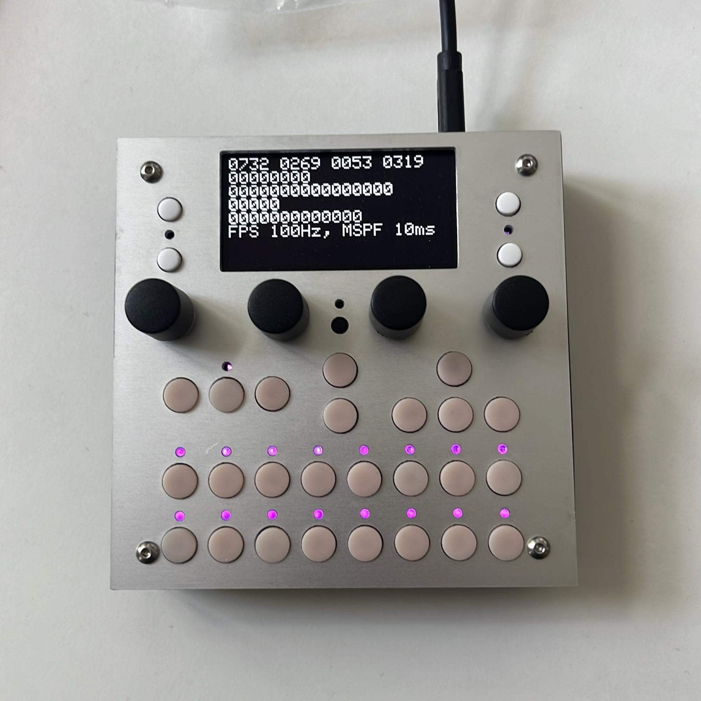

Oh wow,
it looks like you that you are one of the early adopters of the new dadamachines – TBD DSP toolkits!

The **dadamachines – TBD DSP toolkit** is the latest iteration in a family of musical tools and instruments based on the ESP32 series commonly used in Internet of Things devices.

The CTAG project was started as a space to explore technology for creative use with a strong emphasis on music and sound. It aims at creating usable creative tools and devices, exploring upcoming technolgies for creative playful use and foster students creative potential. CTAG is both an idea and also a real lab at the University of Applied Science Kiel (FH Kiel). CTAG has seen many different contributors and projects over the years, from educators to volunteers to students, from class attendees to large contributors to projects like TBD.

- [https://github.com/ctag-fh-kiel/ctag-tbd/](https://github.com/ctag-fh-kiel/ctag-tbd/)
- [https://ctag-fh-kiel.github.io/ctag-tbd/index.html](https://ctag-fh-kiel.github.io/ctag-tbd/index.html)

{: .highlight }
Note: dadamachines provides the TBD DSP toolkits hardware only and does not provide extended software support! The device comes pre-flashed with the open source TBD binaries. You can use our Forum, Discord or the CTAG TBD Github to exchange information about the project or for further development.

