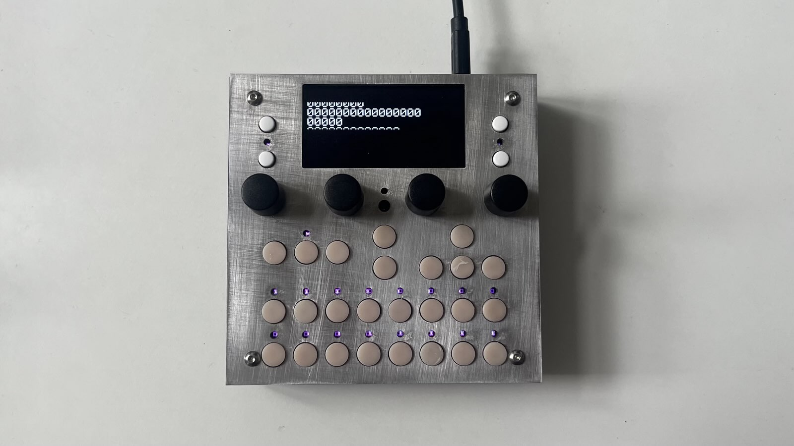

The **dadamachines – TBD DSP toolkit** is a compact, open-source audio platform for creating custom instruments and effects.

Built on the ESP32 architecture, TBD offers a powerful environment for real-time DSP, interfacing, and performance.

Inspired by platforms like [axoloti](https://github.com/axoloti/axoloti), [monome norns](https://monome.org/docs/norns/), [Electrosmith daisy](https://electro-smith.com/products/daisy-seed) and [Bela](https://bela.io/) , TBD brings a playful and extensible toolkit to both musicians and developers. With more than 50 high-quality audio generators and effects, and a plugin system that’s easy to build upon, TBD is part instrument, part playground, part learning space.

The TBD DSP toolkit is a collaboration between [dadamachines](https://dadamachines.com) and [CTAG](https://github.com/ctag-fh-kiel), the Creative Technologies Working Group at University of Applied Science Kiel (FH Kiel), Germany.

## what it is

- A powerful, open-source DSP toolkit.
- An extensible embedded audio platform for real-time sound generation and processing.
- A portable learning and experimentation tool for embedded DSP.
- A hardware module that runs dozens of plugin-based instruments and effects.
- A starting point for your own DSP instruments.

## features

- Over 50 built-in effects, synths, and utilities.
- Plugin architecture for easy extension in C++.
- Web-based configuration UI (via WiFi) and REST-API support.
- Sample ROM playback and user-defined wavetables.
- Cross-platform simulator for plugin development.
- Cloud compiler to build your own firmware sets.

## example media

- 🔊 [SoundCloud examples](https://soundcloud.com/instrumentsofthings/sets/tbd-plugins){:target="_blank"}
- 📹 [YouTube playlist – TBD Eurorack use](https://www.youtube.com/watch?v=4dGQUjqhLj4&list=PLB5iCbhcvJ2qdD7s1o9wsvQ9qtsCUWVLR){:target="_blank"}
- 🎛️ [BBA Preview (MIDI Version)](https://www.youtube.com/watch?v=Lrzo0KT3fXU){:target="_blank"}

  
sections

  {: .fs-6 .fw-700 }
- TOC
{:toc}

## specifications

**audio**

- 3.5mm stereo line in/out
- 3.5mm stereo headphone out with hardware gain control

**interface**

- 2.4" 128×64 white OLED
- 4 endless rotary potentiometeres with push functionality
- 27 tact switches
- 19 RGB LEDs with light guides

**interconnect**

- USB MIDI Device and RNDIS/ECM Web Interface, later possibly Audio Interface
- USB MIDI Host (support for HID devices with custom code)
- 2 x MIDI Input: 3.5mm Type A
- 2 x MIDI Output: 3.5mm Type A
- Optional Bluetooth and WiFi via ESP32-C6

**power**

- USB-C or JTAG-powered with automatic selection
- 15W (5V / 3A) USB-C recommended
- Powerbank operation supported

**processing**

- DSP: ESP32-P4NRW32 dual-core RISC-V @ 360 MHz, 16MB FLash + 32MB PSRAM
- UI: RP2350B ARM Cortex-M33 dual-core @ 150 MHz, 16MB Flash
- Storage: 2× 32GB SD cards
- Audio Codec: TLV320AIC3254 (I²S)

**os**

- RTOS-based firmware

**physical**

- Dimensions: 110mm × 110mm × 25mm
- Weight: 250g
- Materials: anodized aluminum + powder-coated steel
- Early adopter units are black

## plugins

TBD includes a growing library of powerful, diverse plugins for synthesis, effects, and audio processing. These are just some of the factory plugins available:

- **VctrSyn** – vector-based synthesizer  
- **SpaceFX** – spacious stereo effects  
- **Formantor** – formant filter bank  
- **Bjorklund** – euclidean rhythm generator  
- **Karpuskl** – Karplus-Strong string synthesis  
- **APCpp** – analog-style pulse phaser  
- **Retroactor** – lo-fi modulation and bit shaping  
- **Rompler** – sample playback engine  
- **WTOsc** – custom wavetable oscillator  
- **Claude** – port of Mutable Instruments’ granular audio processor  
- **BBeats** – basic beat sequencer  
- **CStrip / CStripM / EveryTrim** – mixing, compression, and tone shaping tools  
- **MISVF** – state variable filter (MI-inspired)  
- **TBD03** – TB-303–style acid synth  
- **PolyPad** – polyphonic pad synthesizer  
- **TBDings** – resonator (based on Mutable Instruments’ Rings)  
- **TBDaits** – macro oscillator (based on Mutable Instruments’ Plaits)  
- **TBDeeps** – wavetable oscillator (based on Mutable Instruments’ Wavetable Oscillator)  
- **DustLoop / Dust** – loopers and granular texture generators  
- **SubSynth** – deep bass synth  
- **Sine Source** – simple sine oscillator  
- **Simple VCA** – basic voltage-controlled amplifier  
- **SDelay** – simple delay  
- **Plate Reverb / MiVerb / MiVerb2 / Progen Reverb / G-Verb / Freeverb** – reverb collection  
- **Pink Noise** – noise generator  
- **MiPShift / MiEnsemble / MiChorus / EChorus** – pitch/ensemble/chorus effects (based on MI)  
- **HiHat1** – drum voice  
- **FBDlyLine / CDelay** – feedback and comb delay lines  
- **Talkbox** – vocoder / speech-style filter  
- **MSxxNoise** – MS-20 style filter and modulation  
- **Antique** – tape/old record effect  
- **Subbotnik** – modulation-heavy analog effect chain

---

## plugin architecture & firmware development

TBD firmware is written in **C++** and designed to be easily extensible. Creating your own plugins is straightforward:

- **Start with a template** like the `SimpleVCA` plugin.
- **Inherit from** the `ctagSoundProcessor.hpp` base class.
- **Implement the `Process(const ProcessData&)`** method — this is your plugin's audio/CV processing loop (similar to VST-style processing).
- **Define plugin parameters** in a dedicated JSON file. This file is used for automatic UI generation in the TBD web interface.

Plugins have access to:
- Audio input/output buffers  
- Control voltages  
- Triggers and gate signals  
All wrapped in the `ProcessData` structure.

The firmware is built using the **Espressif IoT Development Framework (ESP-IDF)** and can be compiled for both the simulator and real hardware.

**Deployment options:**
- Flash firmware via micro-USB  
- Or update directly through the TBD web UI using over-the-air (OTA) updates  

No special tools or debug adapters required.

---

## simulator

To streamline plugin development, TBD includes a **cross-platform simulator** that runs on **macOS, Windows, and Linux**.

The simulator uses **RtAudio** as its audio engine and supports:

- Real-time audio input/output using your system’s sound card  
- Testing plugins with pre-recorded WAV files  
- Debugging your plugin’s logic before flashing it to hardware

This tool dramatically reduces iteration time and makes plugin development faster and easier.

More details and setup instructions are available in the [GitHub repository](https://github.com/ctag-fh-kiel/ctag-tbd).

## contributing

TBD is an open and growing platform. You can:

- Explore and modify the [source code](https://github.com/ctag-fh-kiel/ctag-tbd){:target="_blank"}
- Learn how to [compile firmware](../norns/compiling)
- [Extend the system](../norns/extending) with your own functionality
- Help with documentation, tutorials, and design
- Report issues or ideas via [GitHub](https://github.com/ctag-fh-kiel/ctag-tbd/issues){:target="_blank"}

This project thrives on community collaboration. Whether you're a coder, musician, or designer—your input matters.

## acknowledgements

TBD is part of a rich lineage of open-source music technologies. We extend our gratitude to the creators and maintainers who have contributed to its development:

- Mathias Brüssel [@Visuelle-Musik](https://github.com/Visuelle-Musik)
- Lukas Hermann 
- Robert Manzke [@CTAG](https://github.com/ctag-fh-kiel)
- Michael Jonathan Lee [@mjleehh](https://github.com/mjleehh)
- Lars Schubert
- Per-Olov Jernberg [@possan](https://github.com/possan)
- Justin Mammarella [@jmamma](https://github.com/jmamma)

Have you contributed? Please feel free to add your name here.

TBD was initiated by Robert Manzke and the [CTAG team](https://github.com/ctag-fh-kiel).

---

## disclaimer

The CTAG TBD software is licensed under the [GNU General Public License (GPL 3.0)](https://www.gnu.org/licenses/gpl-3.0.txt).

The CTAG TBD hardware design is released under the [Creative Commons Attribution-NonCommercial-ShareAlike 4.0 International (CC BY-NC-SA 4.0)](https://creativecommons.org/licenses/by-nc-sa/4.0/).

CTAG TBD is provided “as is” without any express or implied warranties.

License and copyright details for specific submodules are included in their respective component folders/files if different from this license.

{: .highlight }
**note:** dadamachines provides the **TBD DSP toolkit** hardware only. Software support is community-driven. Use the [GitHub repo](https://github.com/ctag-fh-kiel/ctag-tbd), [Forum](https://forum.dadamachines.com), or [Discord](https://discord.gg) to get help or contribute.

Found a bug or want to chat? Email us at [help@dadamachines.com](mailto:help@dadamachines.com).
