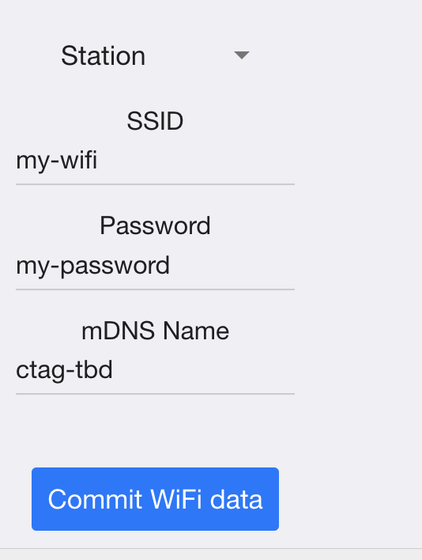

# Midi

There are two ways to use wifi on the TBD BBA to configure your device

## Access Point mode

TBD opens up a wifi by itself. Join the ctag-tbd default network and can access the device by http://ctag-tbd.local/ or http://192.168.4.1/.

## Station Mode

TBD joins an existing network, i.e. you home Wifi or if you are traveling for instance your cell-phone hotspot.

