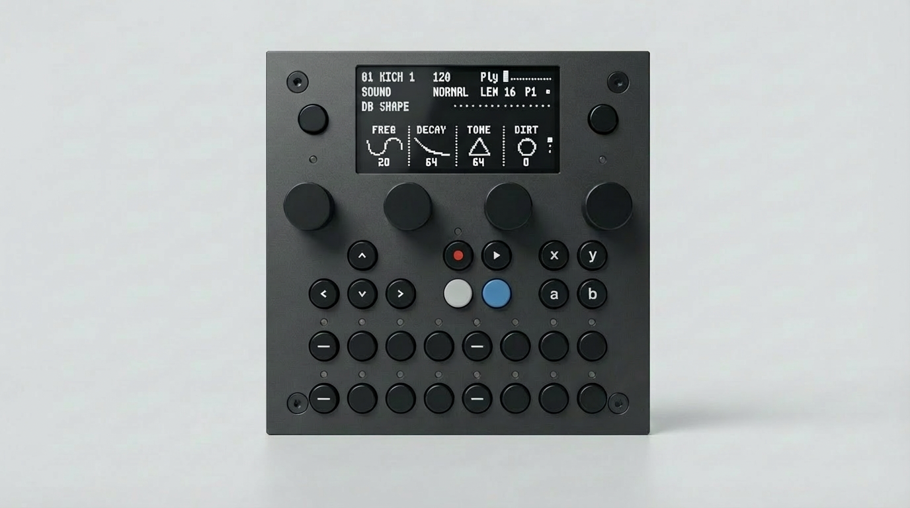

# tbd 16 groovebox

  Preview
  The tbd 16 groovebox has not been released yet — content may change.
  Firmware <code>{{ site.tbd16.firmware_version }}</code> · Updated {{ site.tbd16.manual_updated }}

A 16-track multi-engine performance groovebox with step sequencing, parameter locks, and a browser-based sample-manager and sound design interface.  
Plug in power and play — no computer required.
{: .fs-6 .fw-300 }

This manual documents the **Groovebox** app, which ships installed on the **tbd 16**. The device can also run other apps (MegaCommand Live, Multi Effect/Synth, and more) — see the [Apps](apps/) section.

---

| Section | Description |
|:--------|:------------|
| [Quick Start](getting-started/quickstart) | Power on and make your first beat in 5 minutes |
| [Getting Started](getting-started/) | Overview, hardware layout, navigation |
| [Sequencer](sequencer/) | Tempo, patterns, step editing, parameter locks |
| [Sound & Tracks](sound-and-tracks/) | Sound parameters, track mixer, presets |
| [Machines](machines/) | Sound engines per track — drum synths, tonal voices, sampler, input |
| [Mixer & Effects](mixer-and-effects/) | Signal flow, global mixer, delay, reverb, master output |
| [Project & Settings](project-and-settings/) | Project management, MIDI, display, WiFi, utilities |
| [WebUI](webui/) | File manager and preset/macro manager in the browser |
| [Firmware Updates](firmware-updates) | Keep the device up to date |
| [Hardware](hardware/) | Device layout, connections, button cheat sheet, specs |
| [Troubleshooting](troubleshooting/) | Boot issues, common fixes, recovery |
| [Apps](apps/) | Multi-app system and developer resources |
{: .dada-toc-table }

---

see [github.com/dadamachines/docs](https://github.com/dadamachines/docs){:target="_blank"} to contribute.
e-mail <a href="&#109;&#97;&#105;&#108;&#116;&#111;&#58;%68%65%6C%70%40%64%61%64%61%6D%61%63%68%69%6E%65%73%2E%63%6F%6D">help@dadamachines.com</a> or visit [forum.dadamachines.com](https://forum.dadamachines.com/){:target="_blank"} if you see needed corrections.
